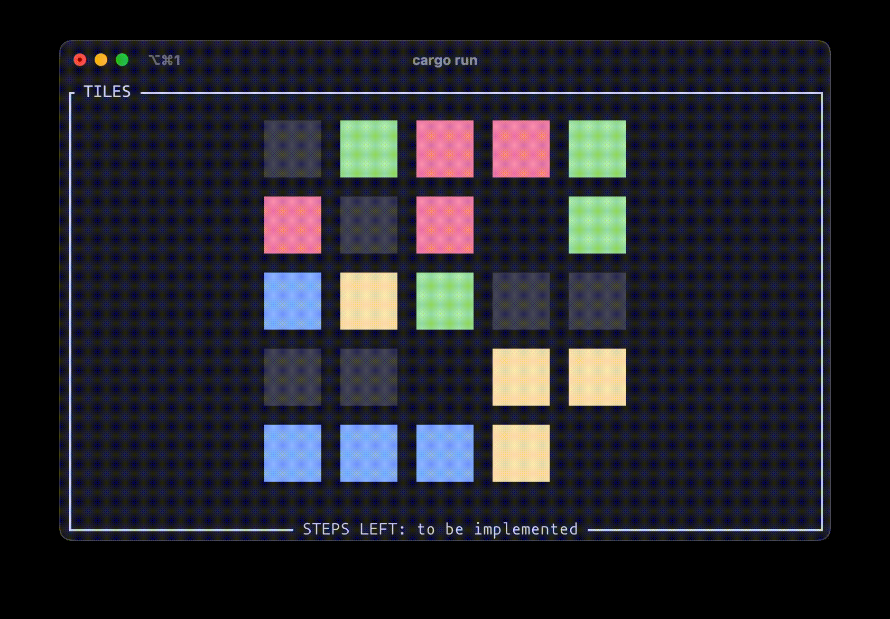

# Tiles

> [!NOTE]
> Inspired by *Color Tiles*.

TODO:
- Game
  - [x] 4+ connected tiles disappear
    - [x] Disappear animation
  - [ ] Integrated solver
  - [ ] Steps before game over
  - [ ] Levels?

- TUI
  - [x] Display the grid
    - [x] Tile color
    - [x] Tile textures
    - [x] Move animation
  - [ ] Import / export save in TUI
    - [ ] Choose save in command line
  - [ ] Edit mode: hjkl / arrow keys to select tile, r (replace) / enter to change tile
  - [ ] Level selection?
